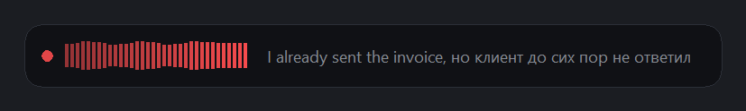
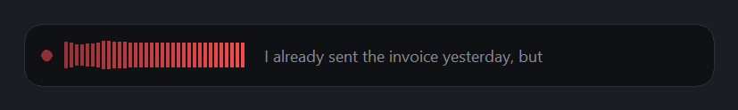
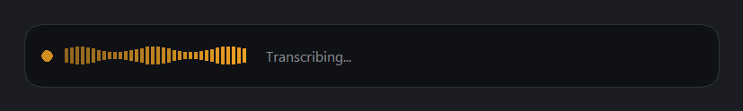

<div align="center">

# VoiceType

**Hold `Ctrl`+`Alt`. Talk. Your words land in whatever you were already typing in.**

Background dictation for Windows that survives switching language *mid-sentence* —<br>
including a sentence you start in English and finish in Russian.

[](#requirements)
[](#requirements)
[](LICENSE)
[](https://github.com/KoljaB/RealtimeSTT)
[](https://github.com/Maslitsa/VoiceType/stargazers)



</div>

---

**[Install](#install) · [How to use it](#how-you-use-it) · [Features](#features) · [Local vs OpenAI](#local-vs-openai) · [Docs](#documentation) · [Something wrong?](#something-wrong)**

---

## What it is

A dictation app that stays out of the way. It starts with Windows and shows no
console, no taskbar button and nothing in `Alt`+`Tab`. Hold `Ctrl`+`Alt` and a
small pill appears just above the taskbar with a live waveform and the words as
they are recognised. Let go and the text is pasted into whatever window you
were already in — and copied to your clipboard.

<div align="center">
<br>
<em>Listening — the waveform is your voice. Preview text is grey because it comes from a<br>small fast model and is only a guess; the final text is white.</em><br><br>
<br>
<em>Transcribing</em><br><br>
<br>
<em>Done — already pasted, and on your clipboard</em>
</div>

---

## Why this exists

I speak three languages and I switch between them without noticing. Every
dictation tool I tried made the same mistake: it picks *one* language per
sentence and then quietly mangles or deletes the rest.

Here is Whisper on a sentence that starts in English and finishes in Russian:

```
Spoken:  "I already sent the invoice yesterday, but клиент до сих пор
          не ответил на моё письмо."

Whisper: "I've already sent me an voice yesterday, but today children
          mind your piece more"
```

It is not mishearing. Whisper commits to a single language token per utterance
and then *translates* — or drops — whatever was said in the other one. Bigger
models make this worse, not better: `small` and `large-v3-turbo` both committed
harder and silently discarded the entire English half where `base` had kept it.

VoiceType fixes it two ways, switchable from the tray:

- **Locally**, by splitting the recording at pauses and detecting the language
  of each piece separately.
- **Through OpenAI**, by sending a `languages` *list* rather than one language,
  so the model expects all of them at once. That list is the setting that
  actually buys seamless switching — the measurements are in
  [docs/accuracy.md](docs/accuracy.md).

The same audio, cloud backend:

```
"I already sent the invoice yesterday, but клиент до сих пор не ответил
 на моё письмо."
```

Both languages, both scripts, one pass.

---

## Install

You need **Windows 10 or 11** and **Python 3.11 or 3.12**
([not 3.13](#requirements) — the installer checks and tells you).

### The easy way

1. [**Download the project as a ZIP**](https://github.com/Maslitsa/VoiceType/archive/refs/heads/main.zip)
   and unzip it somewhere permanent, like `Documents\VoiceType`.
2. Double-click **`INSTALL.bat`**.
3. Wait. The first run downloads a few hundred MB of PyTorch and Whisper
   weights, so give it a few minutes.

That is it. Hold `Ctrl`+`Alt` and talk.

> Windows may show "Windows protected your PC" because the file is not signed.
> Click **More info → Run anyway**. You can read `INSTALL.bat` first — it is
> six lines, and all it does is run `install.ps1` for you.

### The git way

```powershell
git clone https://github.com/Maslitsa/VoiceType.git
cd VoiceType
powershell -ExecutionPolicy Bypass -File .\install.ps1
```

Either way, it creates its own virtual environment, installs everything,
registers VoiceType to start when you sign in, and launches it.

<details>
<summary><b>Optional: use OpenAI instead of local transcription</b></summary>

<br>

Local transcription is free, private and offline, and it is the default. The
cloud backend is better at Russian and is the one that handles seamless
mid-sentence switching.

```powershell
.\install.ps1 -SetApiKey
```

It prompts for the key without echoing it, writes it to
`%APPDATA%\VoiceType\openai.key` and locks that file to your account. The key
is kept **outside the project folder on purpose**, so it cannot be committed by
accident or synced by OneDrive. Then pick *OpenAI* under
**tray → Transcribed by**.

Roughly $0.006 per minute of audio — about $3.60/month at 20 minutes of
dictation a day. Check [current pricing](https://openai.com/api/pricing/).

It is **your own** key and your own OpenAI account: nothing is proxied through
me and there is no shared quota. Without one, VoiceType still works — it just
uses the local model, which is the free, offline, slightly weaker path.

</details>

<details>
<summary><b>Uninstall</b></summary>

<br>

Double-click **`UNINSTALL.bat`**, or:

```powershell
.\install.ps1 -Uninstall
```

Stops it and removes the shortcuts, then tells you where the folder, the
environment and the key file are so you can delete them if you want to.

</details>

---

## How you use it

| Gesture | What happens |
| --- | --- |
| **Hold `Ctrl`+`Alt`** (longer than ~0.7 s) | Records while held. Release to transcribe and insert. |
| **Tap `Ctrl`+`Alt`** (release under ~0.7 s) | Latches on — hands-free. Tap again to finish, or just stop talking and it ends after 2.5 s of silence. |
| **Any other key** while recording | Cancels. Nothing is inserted. |
| **Tray icon** | Status, pin the language, switch backend, pause the hotkey, edit settings, quit. |

Releasing `Ctrl`+`Alt` within 0.25 s does nothing at all. That delay is what
keeps ordinary `Ctrl`+`Alt`+`key` shortcuts — and AltGr on layouts that report
it as Ctrl+Alt — from starting a recording.

**If you say nothing, nothing is pasted.** Whisper will happily invent a
plausible sentence out of silence, so every recording is checked by a voice
activity detector first and dropped if it holds no real speech.

---

## Features

- **Push-to-talk or hands-free** — hold to talk, or tap to latch and let it stop when you do.
- **Genuinely invisible** — runs under `pythonw.exe`: no console, no taskbar button, nothing in `Alt`+`Tab`. The overlay is click-through and never takes focus, so your caret stays exactly where it was.
- **Types into the focused app** — clipboard paste by default, synthesised keystrokes if you prefer, or clipboard only.
- **Live preview** — a tiny model streams words into the pill while a better one produces the final text.
- **Local or cloud, switched from the tray** — Whisper on your CPU, or OpenAI. Falls back to local automatically if the API is unreachable, instead of losing what you just said.
- **Multilingual** — English, Russian and German out of the box; any of Whisper's ~99 languages by adding a line to the config.
- **No hallucinated silence** — a VAD guard on every recording.
- **Optional AI cleanup** — strips filler words and fixes punctuation, with a guard that keeps the raw transcript if the model rewrites too much.
- **Survives sleep** — a watchdog notices when Windows silently drops the keyboard hook and reinstalls it.
- **Never leaves processes behind** — the transcription worker is tied to the app with a Windows job object, so even Task Manager cannot orphan it.

---

## Local vs OpenAI

Measured on the same machine (Ryzen 7 7730U, CPU only) against the same audio,
played through speakers into the microphone so neither backend got a clean
signal.

| | Local (default) | OpenAI |
| --- | --- | --- |
| Model | Whisper `base` on your CPU | `gpt-transcribe` |
| Speed | 1.9 – 3.1 s | 1.2 – 2.0 s |
| English | good | better |
| German | good | better |
| Russian | the weak one | much better |
| Mid-sentence switching | across a pause only | yes, seamlessly |
| Cost | free | ~$0.006/min |
| Privacy | nothing leaves the machine | audio is uploaded when you dictate |
| Offline | yes | no |

The gap is not subtle:

| Spoken | Local `base` | OpenAI |
| --- | --- | --- |
| *Können Sie mir den Bericht bis morgen früh schicken?* | "Das Treffen bringt darauf doll das Tag statt" | exact |
| *I already sent the invoice yesterday but клиент до сих пор не ответил…* | "I've already sent me an voice yesterday, but today children mind your piece more" | exact, both scripts |
| *Ich habe die Rechnung gestern geschickt aber the client has not replied…* | first half garbled | exact, both languages |

Don't take it on trust — `tools/check_cloud.py` synthesises these sentences
using your installed Windows voices and prints what comes back.

---

## Requirements

- **Windows 10 or 11.** The hotkey, the overlay and the paste path are all Win32.
- **Python 3.11 or 3.12.** Not 3.13: RealtimeSTT declares `python_requires >=3.11,<3.13`. The installer checks, and tells you if the Python it found is the wrong version.
- **A microphone.** If you are not sure yours is good enough, `tools/check_mic.py` will tell you plainly.
- No GPU required. A CUDA GPU makes local transcription much faster if you have one.

---

## Something wrong?

Double-click **`CHECKUP.bat`**. It checks the Python version, the
dependencies, your settings, the microphone, the API key, whether VoiceType is
running and whether it starts with Windows — then tells you what to fix.

```
[ ok ] Python version             3.12.14
[ ok ] Dependencies               all present
[ ok ] Settings                   backend=cloud  language=auto-detect
[ ok ] Microphone                 7 device(s), using system default
[ ok ] OpenAI key                 found
[ ok ] Running                    yes
[ ok ] Starts with Windows        yes
```

Anything it cannot fix by itself gets a `->` line telling you what to do. If
that is not enough, [docs/troubleshooting.md](docs/troubleshooting.md) goes
deeper, and an [issue](https://github.com/Maslitsa/VoiceType/issues) is
always welcome.

---

## Documentation

| | |
| --- | --- |
| [docs/configuration.md](docs/configuration.md) | Every setting in `config.json`, and which are worth changing |
| [docs/accuracy.md](docs/accuracy.md) | Measurements: model sizes, language switching, why bigger is worse, why microphone level matters |
| [docs/troubleshooting.md](docs/troubleshooting.md) | "Nothing heard", the hotkey going dead, elevated windows |
| [docs/architecture.md](docs/architecture.md) | How it fits together, and the Windows traps met along the way |
| [CHANGELOG.md](CHANGELOG.md) | What changed, and why |
| [CONTRIBUTING.md](CONTRIBUTING.md) | How to help — reports from other languages and microphones are the most useful |

---

## How it works

```
Ctrl+Alt ──▶ low-level keyboard hook ──▶ state machine
                                              │
                          PyAudio capture ◀────┤
                                 │             │
                 ┌───────────────┴──────┐      │
                 ▼                      ▼      ▼
         RealtimeSTT               raw PCM kept by the app
      (live preview + VAD)                │
                 │                        ▼
                 │                 VAD speech guard
                 │                        │
                 ▼                        ▼
           pill above          Whisper (local)  or  OpenAI
           the taskbar                    │
                                          ▼
                            clipboard  +  paste into the focused window
```

[RealtimeSTT](https://github.com/KoljaB/RealtimeSTT) is driven by hand with
`use_microphone=False`, so it only ever sees audio VoiceType feeds it. It
provides capture, the voice-activity detection that ends a hands-free
recording, and the live preview. The *final* transcript is produced separately,
which is what makes the local/cloud switch and per-segment language detection
possible.

---

## Contributing

Issues and pull requests are welcome — especially from people whose language
pairs I cannot test. See [CONTRIBUTING.md](CONTRIBUTING.md).

## Credits

Built on [RealtimeSTT](https://github.com/KoljaB/RealtimeSTT) by
[Kolja Beigel](https://github.com/KoljaB); the microphone pipeline, VAD and
live preview come from it. Transcription is
[faster-whisper](https://github.com/SYSTRAN/faster-whisper) over
[OpenAI Whisper](https://github.com/openai/whisper), or the OpenAI API.

Full attribution in [NOTICE](NOTICE).

## License

[MIT](LICENSE)
